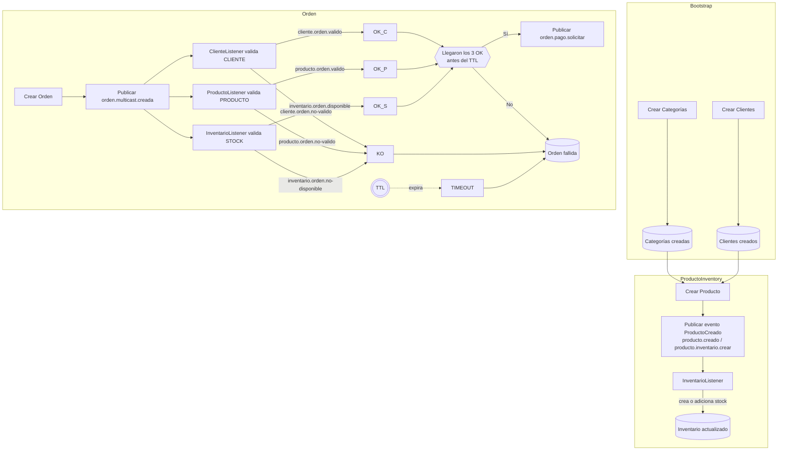

# 🛒 E-Commerce – Clean/DDD, Event-Driven (Rabbit/Kafka)

## 🌟 Visión general
Este proyecto modela un sistema **e-commerce orientado a eventos** y diseñado bajo los principios de **Domain-Driven Design (DDD) + Clean Architecture**. 

Cubre el flujo central del dominio: **creación de órdenes**, **validaciones por bounded contexts** (cliente, producto, inventario), **pago** y **preparación de envío**; todo desacoplado mediante **eventos versionados** y wrappers de integración.

El objetivo es mostrar **cómo orquestar servicios mediante eventos** con perfiles intercambiables de **RabbitMQ** o **Kafka**, aplicando buenas prácticas de arquitectura y pruebas.

> Este sistema está diseñado para crecer hacia infraestructura, APIs REST, mensajería o persistencia sin afectar la lógica del negocio. Todo se basa en un modelo rico, autocontenido y coherente con las reglas del negocio.

---

## ⚙️ Tecnologías clave
- **Java 21**, **Spring Boot 3.5**
- **Clean Architecture + DDD**
- **Spring Data JPA**
  - **H2** en memoria (dev)
  - **PostgreSQL** (perfil `rabbit/docker`)
- **Mensajería**:
  - **RabbitMQ** (`@Profile("rabbit")`)
  - **Kafka** (`@Profile("kafka")`)
- **Jackson** (`ObjectMapper`) para (de)serialización
- **Lombok**
- **JaCoCo** + **SonarQube** (calidad)
- **Docker Compose** para dependencias (Zookeeper/Kafka, RabbitMQ, Postgres, etc.)

---

## 🔍 Principios y buenas prácticas
- **Eventos versionados** y trazables (`traceId`, `timestamp`).
- **IntegrationEventWrapper** como contrato de publicación.
- No se usan eventos genéricos universales.
- Dominios inmutables, controlados mediante **máquina de estados**.
- Separación completa entre **infraestructura, aplicación y dominio**.
- **Value Objects** y entidades con responsabilidad encapsulada.
- **Publishers** y **listeners** por contexto:
  - `publisher/*` (Rabbit/Kafka/ApplicationEvent)
  - `listener/*` (Rabbit/Kafka/In-Memory via `ApplicationEventPublisher`)
- **Máquinas de estados** en dominio (p. ej. `EstadoOrden`, `EstadoEnvio`).
- **Mapper de persistencia** (Entidad ↔ Dominio).
- DTOs de entrada y salida separados, mapeados con MapStruct.
- Configuración externalizada con AppProperties y @ConfigurationProperties.
- TTL en Redis como estrategia de expiración distribuida.
- Resultados ricos con clases, evitando tipos primitivos.
- **Perfiles** activables para cambiar el “bus” de eventos.

---

## 🧠 Enfoque Arquitectónico

### ✅ Clean Architecture + DDD

**Capas:**
- **domain**: entidades, VOs, estados, reglas (sin dependencias externas).
- **application**: servicios de orquestación, comandos y eventos.
- **infrastructure**: persistencia (JPA), mensajería (Rabbit/Kafka), configuración, etc.
- **adapters**: adaptadores web.

### 🗃️ Persistencia y mapeo
- **JPA Entities** en `infrastructure.persistence.entity`.
- **Mappers** en `infrastructure.persistence.mapper` (ej.: `OrdenMapper`, `EnvioMapper`, `PagoMapper`…).
- **DB**:
  - **Dev** (por defecto): `H2` en memoria (ver `application.yml`).
  - **Docker / Rabbit**: `PostgreSQL` (ver `application-rabbit.yml`, `application-rabbit.yml`).

---

## 🐳 Instalación con Docker Compose

Este proyecto puede ejecutarse de forma completa con **Docker Compose** incluyendo sus dependencias como PostgreSQL, Rabbit y Kafka.

### 🔧 Requisitos

- Docker
- Docker Compose

### ▶️ Comandos para ejecutar

```bash
# Situarse dentro de la carpeta del proyecto y ejecutar
docker compose -p ecommerce up -d

# Una vez ejecutado el comando anterior, se puede verificar con
docker ps
```

### 🧪 Verificación

Una vez iniciado el entorno, accede a:

- API: [http://localhost:8095/api/flight](http://localhost:8095/api/flight)
- Swagger: [http://localhost:8095/swagger-ui.html](http://localhost:8095/swagger-ui.html)

---

## 📨 Mensajería y perfiles

### RabbitMQ (`@Profile("rabbit")`)
- **Publisher**: `RabbitMQEventPublisher`.
- **Listeners**: `.../rabbitlistener/*`.
- Config externo en `application-rabbit.yml`.

### Kafka (`@Profile("kafka")`)
- **Publisher**: `KafkaEventPublisher`.
- **Listeners**: `.../kafkalistener/*`.
- Config en `KafkaConfig`/`KafkaTopicConfig`.
- Config externo en `application-kafka.yml`.

> Cambia el bus activando el perfil correspondiente. Los nombres de colas/tópicos/grupos están externalizados en `AppProperties`.


### 🧩 Diagrama de flujo




```mermaid


```

---

