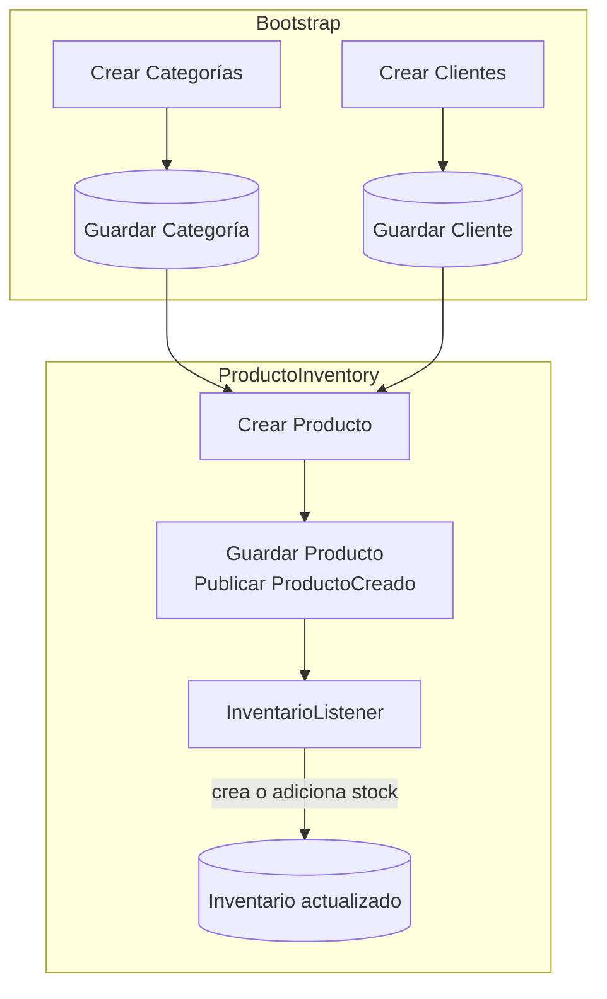
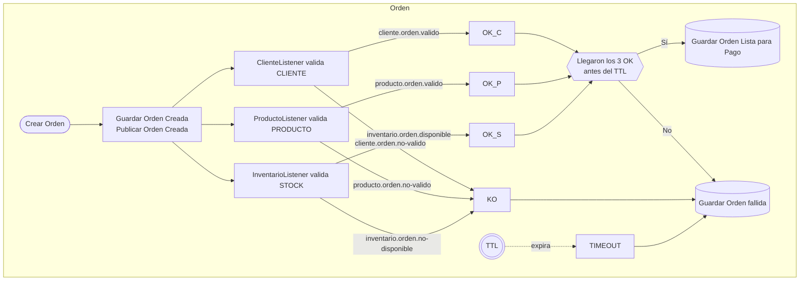

# 🛒 E-Commerce – Clean/DDD, Event-Driven (Rabbit/Kafka)

## 🌟 Visión general
Este proyecto modela un sistema **e-commerce orientado a eventos** y diseñado bajo los principios de **Domain-Driven Design (DDD) + Clean Architecture**. 

Cubre el flujo central del dominio: **creación de órdenes**, **validaciones por bounded contexts** (cliente, producto, inventario), **pago** y **preparación de envío**; todo desacoplado mediante **eventos versionados** y wrappers de integración.

El objetivo es mostrar **cómo orquestar servicios mediante eventos** con perfiles intercambiables de **RabbitMQ** o **Kafka**, aplicando buenas prácticas de arquitectura y pruebas.

> Este sistema está diseñado para crecer hacia infraestructura, APIs REST, mensajería o persistencia sin afectar la lógica del negocio. Todo se basa en un modelo rico, autocontenido y coherente con las reglas del negocio.

---

## ⚙️ Tecnologías clave
- **Java 21**, **Spring Boot 3.5**
- **Clean Architecture + DDD**
- **Spring Data JPA**
  - **H2** en memoria (dev)
  - **PostgreSQL** (perfil `rabbit/docker`)
- **Mensajería**:
  - **RabbitMQ** (`@Profile("rabbit")`)
  - **Kafka** (`@Profile("kafka")`)
- **Jackson** (`ObjectMapper`) para (de)serialización
- **Lombok**
- **JaCoCo** + **SonarQube** (calidad)
- **Docker Compose** para dependencias (Zookeeper/Kafka, RabbitMQ, Postgres, etc.)

---

## 🔍 Principios y buenas prácticas
- **Eventos versionados** y trazables (`traceId`, `timestamp`).
- **IntegrationEventWrapper** como contrato de publicación.
- No se usan eventos genéricos universales.
- Dominios inmutables, controlados mediante **máquina de estados**.
- Separación completa entre **infraestructura, aplicación y dominio**.
- **Value Objects** y entidades con responsabilidad encapsulada.
- **Publishers** y **listeners** por contexto:
  - `publisher/*` (Rabbit/Kafka/ApplicationEvent)
  - `listener/*` (Rabbit/Kafka/In-Memory via `ApplicationEventPublisher`)
- **Máquinas de estados** en dominio (p. ej. `EstadoOrden`, `EstadoEnvio`).
- **Mapper de persistencia** (Entidad ↔ Dominio).
- DTOs de entrada y salida separados, mapeados con MapStruct.
- Configuración externalizada con AppProperties y @ConfigurationProperties.
- TTL en Redis como estrategia de expiración distribuida.
- Resultados ricos con clases, evitando tipos primitivos.
- **Perfiles** activables para cambiar el “bus” de eventos.

---

## 🧠 Enfoque Arquitectónico

### ✅ Clean Architecture + DDD

**Capas:**
- **domain**: entidades, VOs, estados, reglas (sin dependencias externas).
- **application**: servicios de orquestación, comandos y eventos.
- **infrastructure**: persistencia (JPA), mensajería (Rabbit/Kafka), configuración, etc.
- **adapters**: adaptadores web.

### 🗃️ Persistencia y mapeo
- **JPA Entities** en `infrastructure.persistence.entity`.
- **Mappers** en `infrastructure.persistence.mapper` (ej.: `OrdenMapper`, `EnvioMapper`, `PagoMapper`…).
- **DB**:
  - **Dev** (por defecto): `H2` en memoria (ver `application.yml`).
  - **Docker / Rabbit**: `PostgreSQL` (ver `application-rabbit.yml`, `application-rabbit.yml`).

---

## 🐳 Instalación con Docker Compose

Este proyecto puede ejecutarse de forma completa con **Docker Compose** incluyendo sus dependencias como PostgreSQL, Rabbit y Kafka.

### 🔧 Requisitos

- Docker
- Docker Compose

### ▶️ Comandos para ejecutar

```bash
# Situarse dentro de la carpeta del proyecto y ejecutar
docker compose -p ecommerce up -d

# Una vez ejecutado el comando anterior, se puede verificar con
docker ps
```

---

## 📨 Mensajería y perfiles

### RabbitMQ (`@Profile("rabbit")`)
- **Publisher**: `RabbitMQEventPublisher`.
- **Listeners**: `.../rabbitlistener/*`.
- Config externo en `application-rabbit.yml`.

### Kafka (`@Profile("kafka")`)
- **Publisher**: `KafkaEventPublisher`.
- **Listeners**: `.../kafkalistener/*`.
- Config en `KafkaConfig`/`KafkaTopicConfig`.
- Config externo en `application-kafka.yml`.

> Cambia el bus activando el perfil correspondiente. Los nombres de colas/tópicos/grupos están externalizados en `AppProperties`.

---

## 📚 Documentación de la API (Swagger / OpenAPI)

Este proyecto expone una interfaz interactiva Swagger UI para consultar los endpoints disponibles.

- **Swagger UI**:  
  👉 [http://localhost:8093/swagger-ui.html](http://localhost:8093/swagger-ui.html)

- **OpenAPI YAML** (especificación de contrato):  
  👉 [http://localhost:8093/v3/api-docs.yaml](http://localhost:8093/v3/api-docs.yaml)

La documentación se genera automáticamente gracias a la integración con `springdoc-openapi` y se actualiza con base en los controladores REST definidos.

---

### 🧩 Diagrama de flujo

```mermaid
flowchart TD

%% =========================
%% Post-pago: Pago -> Envío -> Orden
%% =========================
  subgraph Pago - Envio
    USER_PAY([Iniciar Pago]) --> O_PAGO_REQ[Guardar Orden pago en proceso]
    O_PAGO_REQ --> E_PAGO_REQ[Publicar orden.pago.solicitar]
    E_PAGO_REQ --> PAGO_LIST[PagoListener procesa]
    PAGO_LIST --> PAGO_PROC[Realizar pago con proveedor]
    PAGO_PROC --> PAGO_SAVE[(Guardar Pago)]
    PAGO_PROC -->|pago.orden.confirmado ok| PAGO_OK[Publicar pago.orden.confirmado]
    PAGO_PROC -->|pago.orden.confirmado fail| PAGO_KO[Publicar pago.orden.confirmado]

  %% Orden reacciona a pago
    PAGO_OK --> ORD_ON_PAY_OK[Orden escucha pago ok <br/> Guardar Orden pago ok]
    PAGO_KO --> ORD_ON_PAY_KO[Orden escucha pago fail <br/> Guardar Orden fallida]

  %% Orden solicita preparar envío tras pago OK
    ORD_ON_PAY_OK --> ORD_ENVIO[Publicar orden.envio.preparar]

  %% Envío
    ORD_ENVIO --> ENVIO_LIST[EnvioListener procesa]
    ENVIO_LIST --> ENVIO_PROC[Preparar envío]
    ENVIO_PROC --> ENVIO_SAVE[Guardar Envío <br/> Guardar Historial Envío]
    ENVIO_SAVE --> ENVIO_OK[Publicar envio.orden.preparado ok]
    ENVIO_PROC --> ENVIO_KO[Publicar envio.orden.preparado fail]

  %% Orden cierra según resultado del envío
    ENVIO_OK --> ORD_ON_ENV_OK[Orden escucha envío ok <br/> Guardar Orden completada]
    ENVIO_KO --> ORD_ON_ENV_KO[Orden escucha envío fail <br/> Guardar Orden fallida]
  end


```






---

## 🗂️ Estructura de Proyecto: Arquitectura Hexagonal

```
src/main/java/com/aug/ecommerce
├── adapters
│   ├── rest
│   │   ├── controllers
│   │   │   ├── OrdenController.java                          # Controlador REST de endpoints HTTP
│   │   │   └── PagoController.java                           # Controlador REST de endpoints HTTP
│   │   ├── dtos
│   │   │   ├── CrearCategoriaRequestDTO.java                 # DTO request/response REST
│   │   │   ├── CrearClienteRequestDTO.java                   # DTO request/response REST
│   │   │   ├── CrearProductoRequestDTO.java                  # DTO request/response REST
│   │   │   ├── RealizarOrdenRequestDTO.java                  # DTO request/response REST
│   │   │   └── RealizarPagoRequestDTO.java                   # DTO request/response REST
│   │   ├── mappers
│   │   │   ├── CategoriaMapper.java                          # Mapper DTO ↔ dominio/commands
│   │   │   ├── ClienteMapper.java                            # Mapper DTO ↔ dominio/commands
│   │   │   ├── OrdenMapper.java                              # Mapper DTO ↔ dominio/commands
│   │   │   └── ProductoMapper.java                           # Mapper DTO ↔ dominio/commands
├── application
│   ├── commands
│   │   ├── CrearCategoriaCommand.java                    # Comando de aplicación (caso de uso)
│   │   ├── CrearClienteCommand.java                      # Comando de aplicación (caso de uso)
│   │   ├── CrearInventarioCommand.java                   # Comando de aplicación (caso de uso)
│   │   ├── CrearProductoCommand.java                     # Comando de aplicación (caso de uso)
│   │   ├── RealizarOrdenCommand.java                     # Comando de aplicación (caso de uso)
│   │   └── RealizarPagoCommand.java                      # Comando de aplicación (caso de uso)
│   ├── dtos
│   │   ├── ResultadoEnvioDTO.java                        # Clase de soporte
│   │   └── ResultadoPagoDTO.java                         # Clase de soporte
│   ├── events
│   │   ├── ClienteNoValidadoEvent.java                   # Evento de integración publicado/consumido
│   │   ├── ClienteValidadoEvent.java                     # Evento de integración publicado/consumido
│   │   ├── EnvioPreparadoEvent.java                      # Evento de integración publicado/consumido
│   │   ├── IntegrationEvent.java                         # Interfaz base para eventos de integración
│   │   ├── InventarioNoValidadoEvent.java                # Evento de integración publicado/consumido
│   │   ├── InventarioValidadoEvent.java                  # Evento de integración publicado/consumido
│   │   ├── OrdenCreadaEvent.java                         # Evento de integración publicado/consumido
│   │   ├── OrdenPagadaEvent.java                         # Evento de integración publicado/consumido
│   │   ├── OrdenPreparadaParaPagoEvent.java              # Evento de integración publicado/consumido
│   │   ├── PagoConfirmadoEvent.java                      # Evento de integración publicado/consumido
│   │   ├── ProductoCreadoEvent.java                      # Evento de integración publicado/consumido
│   │   ├── ProductoNoValidadoEvent.java                  # Evento de integración publicado/consumido
│   │   └── ProductoValidadoEvent.java                    # Evento de integración publicado/consumido
│   ├── gateways
│   │   ├── PasarelaPagoClient.java                       # Puerto de salida a servicios externos
│   │   └── ProveedorEnvioClient.java                     # Puerto de salida a servicios externos
│   ├── publishers
│   │   ├── ClienteEventPublisher.java                    # Puerto de salida: publicar eventos
│   │   ├── EnvioEventPublisher.java                      # Puerto de salida: publicar eventos
│   │   ├── InventarioEventPublisher.java                 # Puerto de salida: publicar eventos
│   │   ├── OrdenEventPublisher.java                      # Puerto de salida: publicar eventos
│   │   ├── PagoEventPublisher.java                       # Puerto de salida: publicar eventos
│   │   └── ProductoEventPublisher.java                   # Puerto de salida: publicar eventos
│   ├── services
│   │   ├── CategoriaService.java                         # Servicio de aplicación (orquestación)
│   │   ├── ClienteService.java                           # Servicio de aplicación (orquestación)
│   │   ├── ClienteValidacionService.java                 # Servicio de aplicación (orquestación)
│   │   ├── EnvioService.java                             # Servicio de aplicación (orquestación)
│   │   ├── InventarioService.java                        # Servicio de aplicación (orquestación)
│   │   ├── InventarioValidacionService.java              # Servicio de aplicación (orquestación)
│   │   ├── OrdenService.java                             # Servicio de aplicación (orquestación)
│   │   ├── OrdenValidacionService.java                   # Servicio de aplicación (orquestación)
│   │   ├── PagoService.java                              # Servicio de aplicación (orquestación)
│   │   ├── ProductoService.java                          # Servicio de aplicación (orquestación)
│   │   ├── ProductoValidacionService.java                # Servicio de aplicación (orquestación)
│   │   └── ValidacionCrearOrden.java                     # Servicio de aplicación (orquestación)
├── domain
│   ├── models
│   │   ├── categoria
│   │   │   └── Categoria.java                                # Agregado/Entidad del dominio con reglas
│   │   ├── cliente
│   │   │   ├── Cliente.java                                  # Agregado/Entidad del dominio con reglas
│   │   │   └── Direccion.java                                # Agregado/Entidad del dominio con reglas
│   │   ├── envio
│   │   │   ├── Envio.java                                    # Agregado/Entidad del dominio con reglas
│   │   │   ├── EnvioEstadoHistorial.java                     # Agregado/Entidad del dominio con reglas
│   │   │   └── EstadoEnvio.java                              # Enum del dominio
│   │   ├── inventario
│   │   │   └── Inventario.java                               # Agregado/Entidad del dominio con reglas
│   │   ├── orden
│   │   │   ├── EstadoOrden.java                              # Enum del dominio
│   │   │   ├── ItemOrden.java                                # Agregado/Entidad del dominio con reglas
│   │   │   └── Orden.java                                    # Agregado/Entidad del dominio con reglas
│   │   ├── pago
│   │   │   ├── EstadoPago.java                               # Enum del dominio
│   │   │   └── Pago.java                                     # Agregado/Entidad del dominio con reglas
│   │   ├── producto
│   │   │   └── Producto.java                                 # Agregado/Entidad del dominio con reglas
│   ├── repositories
│   │   ├── CategoriaRepository.java                      # Clase de soporte
│   │   ├── ClienteRepository.java                        # Clase de soporte
│   │   ├── EnvioRepository.java                          # Clase de soporte
│   │   ├── InventarioRepository.java                     # Clase de soporte
│   │   ├── OrdenRepository.java                          # Clase de soporte
│   │   ├── PagoRepository.java                           # Clase de soporte
│   │   └── ProductoRepository.java                       # Clase de soporte
├── infrastructure
│   ├── config
│   │   ├── AppProperties.java                            # Configuración de infraestructura (beans/properties)
│   │   ├── KafkaConfig.java                              # Configuración de infraestructura (beans/properties)
│   │   ├── KafkaTopicConfig.java                         # Configuración de infraestructura (beans/properties)
│   │   └── RabbitMQConfig.java                           # Configuración de infraestructura (beans/properties)
│   ├── external
│   │   ├── delivery
│   │   │   └── ProveedorEnvioHttpClient.java                 # Clase de soporte
│   │   ├── pago
│   │   │   └── WompiPasarelaPagoClient.java                  # Clase de soporte
│   ├── init
│   │   ├── AppStartupFinalListener.java                  # Inicializador/Hook de arranque
│   │   ├── CategoriaInitializer.java                     # Inicializador/Hook de arranque
│   │   ├── ClienteInitializer.java                       # Inicializador/Hook de arranque
│   │   ├── OrdenInitializer.java                         # Inicializador/Hook de arranque
│   │   ├── PagoInitializer.java                          # Inicializador/Hook de arranque
│   │   └── ProductoInitializer.java                      # Inicializador/Hook de arranque
│   ├── logger
│   │   ├── CircuitBreakerEventLogger.java                # Logger/monitor de eventos de resiliencia
│   │   └── RetryEventLogger.java                         # Logger/monitor de eventos de resiliencia
│   ├── messaging
│   │   ├── listener
│   │   │   ├── eventlistener
│   │   │   │   ├── ClienteEventListener.java                     # Listener en memoria (ApplicationEventPublisher)
│   │   │   │   ├── EnvioEventListener.java                       # Listener en memoria (ApplicationEventPublisher)
│   │   │   │   ├── InventarioEventListener.java                  # Listener en memoria (ApplicationEventPublisher)
│   │   │   │   ├── OrdenEventListener.java                       # Listener en memoria (ApplicationEventPublisher)
│   │   │   │   ├── PagoEventListener.java                        # Listener en memoria (ApplicationEventPublisher)
│   │   │   │   └── ProductoEventListener.java                    # Listener en memoria (ApplicationEventPublisher)
│   │   │   ├── kafkalistener
│   │   │   │   ├── ClienteKafkaListener.java                     # Listener Kafka para consumir eventos
│   │   │   │   ├── EnvioKafkaListener.java                       # Listener Kafka para consumir eventos
│   │   │   │   ├── InventarioKafkaListener.java                  # Listener Kafka para consumir eventos
│   │   │   │   ├── OrdenKafkaListener.java                       # Listener Kafka para consumir eventos
│   │   │   │   ├── PagoKafkaListener.java                        # Listener Kafka para consumir eventos
│   │   │   │   └── ProductoKafkaListener.java                    # Listener Kafka para consumir eventos
│   │   │   ├── rabbitlistener
│   │   │   │   ├── ClienteRabbitListener.java                    # Listener RabbitMQ para consumir eventos
│   │   │   │   ├── EnvioRabbitListener.java                      # Listener RabbitMQ para consumir eventos
│   │   │   │   ├── InventarioRabbitListener.java                 # Listener RabbitMQ para consumir eventos
│   │   │   │   ├── OrdenRabbitListener.java                      # Listener RabbitMQ para consumir eventos
│   │   │   │   ├── PagoRabbitListener.java                       # Listener RabbitMQ para consumir eventos
│   │   │   │   └── ProductoRabbitListener.java                   # Listener RabbitMQ para consumir eventos
│   │   ├── publisher
│   │   │   ├── eventpublisher
│   │   │   │   ├── ClienteEventPublisherImp.java                 # Publisher en memoria de eventos
│   │   │   │   ├── EnvioEventPublisherImp.java                   # Publisher en memoria de eventos
│   │   │   │   ├── InventarioEventPublisherImp.java              # Publisher en memoria de eventos
│   │   │   │   ├── OrdenEventPublisherImp.java                   # Publisher en memoria de eventos
│   │   │   │   ├── PagoEventPublisherImp.java                    # Publisher en memoria de eventos
│   │   │   │   └── ProductoEventPublisherImp.java                # Publisher en memoria de eventos
│   │   │   ├── kafkapublisher
│   │   │   │   ├── ClienteKafkaEventPublisherImp.java            # Publisher Kafka de eventos
│   │   │   │   ├── EnvioKafkaEventPublisherImp.java              # Publisher Kafka de eventos
│   │   │   │   ├── InventarioKafkaEventPublisherImp.java         # Publisher Kafka de eventos
│   │   │   │   ├── OrdenKafkaEventPublisherImp.java              # Publisher Kafka de eventos
│   │   │   │   ├── PagoKafkaEventPublisherImp.java               # Publisher Kafka de eventos
│   │   │   │   └── ProductoKafkaEventPublisherImp.java           # Publisher Kafka de eventos
│   │   │   ├── rabbitpublisher
│   │   │   │   ├── ClienteRabbitEventPublisherImp.java           # Publisher RabbitMQ de eventos
│   │   │   │   ├── EnvioRabbitEventPublisherImp.java             # Publisher RabbitMQ de eventos
│   │   │   │   ├── InventarioRabbitEventPublisherImp.java        # Publisher RabbitMQ de eventos
│   │   │   │   ├── OrdenRabbitEventPublisherImp.java             # Publisher RabbitMQ de eventos
│   │   │   │   ├── PagoRabbitEventPublisherImp.java              # Publisher RabbitMQ de eventos
│   │   │   │   └── ProductoRabbitEventPublisherImp.java          # Publisher RabbitMQ de eventos
│   │   ├── EventTypeResolver.java                        # Clase de soporte
│   │   ├── IntegrationEventWrapper.java                  # Envoltura común de eventos (tipo, versión, datos)
│   │   ├── KafkaEventPublisher.java                      # Clase de soporte
│   │   └── RabbitMQEventPublisher.java                   # Clase de soporte
│   ├── persistence
│   │   ├── adapter
│   │   │   ├── CategoriaRepositoryAdapter.java               # Adaptador a repositorios JPA
│   │   │   ├── ClienteRepositoryAdapter.java                 # Adaptador a repositorios JPA
│   │   │   ├── EnvioRepositoryAdapter.java                   # Adaptador a repositorios JPA
│   │   │   ├── InventarioRepositoryAdapter.java              # Adaptador a repositorios JPA
│   │   │   ├── OrdenRepositoryAdapter.java                   # Adaptador a repositorios JPA
│   │   │   ├── PagoRepositoryAdapter.java                    # Adaptador a repositorios JPA
│   │   │   └── ProductoRepositoryAdapter.java                # Adaptador a repositorios JPA
│   │   ├── entity
│   │   │   ├── enums
│   │   │   │   └── EstadoEnvioEntity.java                        # Enum persistente (JPA)
│   │   │   ├── CategoriaEntity.java                          # Entidad JPA persistente
│   │   │   ├── ClienteEntity.java                            # Entidad JPA persistente
│   │   │   ├── DireccionEntity.java                          # Entidad JPA persistente
│   │   │   ├── EnvioEntity.java                              # Entidad JPA persistente
│   │   │   ├── EnvioEstadoHistorialEntity.java               # Entidad JPA persistente
│   │   │   ├── InventarioEntity.java                         # Entidad JPA persistente
│   │   │   ├── ItemOrdenEntity.java                          # Entidad JPA persistente
│   │   │   ├── OrdenEntity.java                              # Entidad JPA persistente
│   │   │   ├── PagoEntity.java                               # Entidad JPA persistente
│   │   │   └── ProductoEntity.java                           # Entidad JPA persistente
│   │   ├── mapper
│   │   │   ├── CategoriaMapper.java                          # Mapper de persistencia Entidad ↔ Dominio
│   │   │   ├── ClienteMapper.java                            # Mapper de persistencia Entidad ↔ Dominio
│   │   │   ├── EnvioMapper.java                              # Mapper de persistencia Entidad ↔ Dominio
│   │   │   ├── InventarioMapper.java                         # Mapper de persistencia Entidad ↔ Dominio
│   │   │   ├── OrdenMapper.java                              # Mapper de persistencia Entidad ↔ Dominio
│   │   │   ├── PagoMapper.java                               # Mapper de persistencia Entidad ↔ Dominio
│   │   │   └── ProductoMapper.java                           # Mapper de persistencia Entidad ↔ Dominio
│   │   ├── repository
│   │   │   ├── JpaCategoriaCrudRepository.java               # Repositorio JPA (CRUD/consultas)
│   │   │   ├── JpaClienteCrudRepository.java                 # Repositorio JPA (CRUD/consultas)
│   │   │   ├── JpaEnvioCrudRepository.java                   # Repositorio JPA (CRUD/consultas)
│   │   │   ├── JpaInventarioCrudRepository.java              # Repositorio JPA (CRUD/consultas)
│   │   │   ├── JpaOrdenCrudRepository.java                   # Repositorio JPA (CRUD/consultas)
│   │   │   ├── JpaPagoCrudRepository.java                    # Repositorio JPA (CRUD/consultas)
│   │   │   └── JpaProductoCrudRepository.java                # Repositorio JPA (CRUD/consultas)
│   ├── scheduler
│   │   └── EnvioRetryScheduler.java                      # Tarea programada (scheduler)
└── EcommerceApplication.java                     # Clase principal que arranca la app Spring Boot
```
---

## ✅ Conclusión
Este repo aterriza un e-commerce event-driven con Clean/DDD: validaciones all-of con TTL, estados consistentes y mensajería intercambiable (Rabbit/Kafka).
Mapea/persiste agregados, publica/consume eventos versionados y cuenta con pruebas unitarias listas.
Es una base sólida para escalar a producción (outbox, idempotencia, observabilidad).

